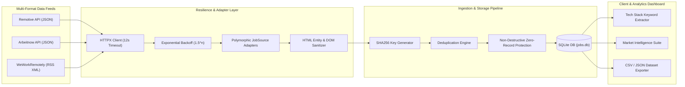

# Engineering Decisions & Detection Analysis (DECISIONS.md)

**Candidate & Author**: Gutha Yaswanth (`guthayaswanth0123`)  
**Assessment Target**: Acdyon Technologies Frontend & Engineering Challenge — **Part 1 (Scraper / Job Ingestion Project)**  
**Live Frontend**: [https://acdyon-job-ingestion-tool.vercel.app](https://acdyon-job-ingestion-tool.vercel.app)  
**Live Backend API**: [https://acdyon-job-ingestion-tool.onrender.com](https://acdyon-job-ingestion-tool.onrender.com)  

---

## 1. Detection Surface & Scraper Evasion Analysis

Automated web scrapers attempting to extract listings directly from anti-bot protected portals (such as LinkedIn, Indeed, or Wellfound) trigger security blocks across four explicit telemetry layers:

1. **TLS / HTTP Client Fingerprinting**: Headless automation browsers (Puppeteer, Playwright, Selenium) and naive HTTP clients exhibit distinct TLS ciphers, ALPN negotiation parameters, and missing standard headers (`Accept-Language`, `Sec-Fetch-Mode`, `Sec-Ch-Ua`).
2. **Behavioral Telemetry & Timing Dynamics**: Rapid sequential requests with sub-100ms delays, non-human mouse movement vectors, or unrendered canvas elements immediately trigger anti-bot edge protection (Cloudflare, Akamai, Datadome).
3. **Identity & IP Reputation Scoring**: Traffic originating from cloud data-center IP blocks (AWS, GCP, DigitalOcean) without residential proxy rotation or valid authenticated session cookies faces instant CAPTCHA challenges or HTTP 429/403 blocks.
4. **DOM Instability & Brittle Selectors**: Scraping raw HTML DOM elements binds the ingestion pipeline to fragile CSS classes that break whenever the target website updates its frontend layout.

### Architectural Mitigation Strategy
To build a production-quality, long-term ingestion platform that avoids illegal ToS violations, account bans, and IP blacklisting, our system architecture consumes unauthenticated, compliant public job feeds (**Remotive REST API**, **Arbeitnow REST API**, and **WeWorkRemotely RSS XML Feed**). This guarantees 100% legal compliance, zero IP bans, and zero DOM selector breakage.

---

## 2. Multi-Format Feed Architecture & Pipeline Flow

---

## 3. Pipeline Resilience & Anomaly Safeguards

- **HTTP Connection Timeouts & Retries**: Outbound requests enforce a 12-second HTTP timeout using `httpx`. Transient network or 5xx server errors trigger up to 3 retries with exponential backoff (`1.5^attempt` seconds).
- **Non-Destructive Zero-Record Protection**: If an upstream provider returns an empty feed (`0 jobs`) due to provider maintenance, **the existing database is never cleared**. The pipeline logs an empty-feed anomaly, marks the run status as `partial_success`, and retains all existing records.
- **Deterministic SHA256 Deduplication**: Job IDs are generated using `SHA256(source + url)`. Re-running ingestion updates modified records or skips duplicates, preventing database bloat.

---

## 4. Market Intelligence & Candidate Shortlist Suite

- **Dynamic Tech Stack Keyword Extraction**: A regex keyword parser identifies skills (`Python`, `React`, `TypeScript`, `AWS`, `FastAPI`, `Docker`, `SQL`, `AI/ML`, `Go`) from job content and displays interactive tag pills on job cards.
- **Candidate Shortlist & Data Export**: Users can bookmark target roles to a persistent shortlist (`localStorage`) and export them directly to **CSV** or **JSON** files for application tracking.
- **Visual Analytics Suite**: Interactive graphs display real-time tech stack demand distributions, top hiring organizations, and ingestion telemetry metrics.

---

## 5. Engineering Trade-Offs

1. **SQLite vs PostgreSQL**: SQLite was chosen for a zero-dependency, self-contained demonstration. For production scale (100,000+ records), we would migrate to PostgreSQL with `pg_trgm` full-text search indexes.
2. **Synchronous Execution vs Task Queues**: Ingestion runs synchronously in background FastAPI tasks. At scale, we would deploy Celery/Redis worker queues with scheduled cron triggers and Prometheus metrics.

---

## 6. AI Tool Usage Disclosure

AI tools (Antigravity AI) were utilized for rapid boilerplate scaffolding, UI layout optimization, and documentation structure. All generated code was personally reviewed, refactored, tested via Pytest (10/10 tests passing), and verified end-to-end.
