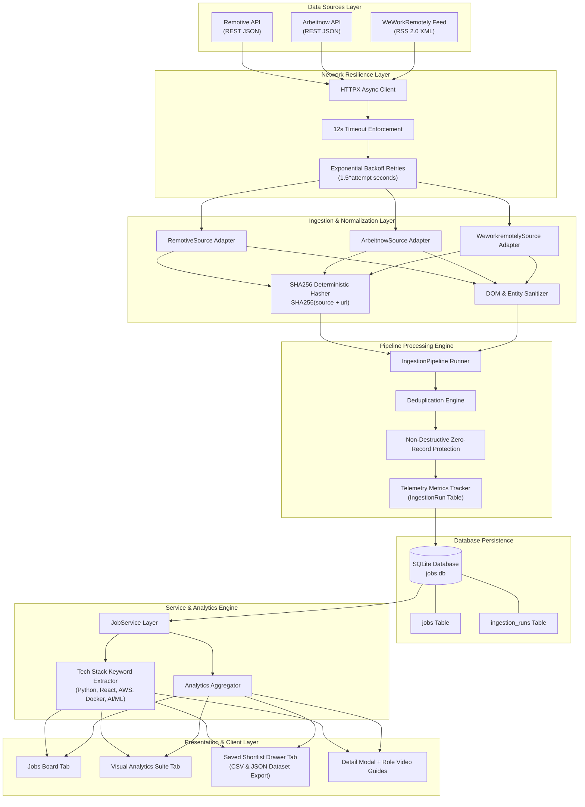

# Acdyon Ingest — Resilient Multi-Source Job Ingestion & Market Analytics Platform

[](https://fastapi.tiangolo.com/)
[](https://reactjs.org/)
[](https://www.typescriptlang.org/)
[](https://tailwindcss.com/)
[](https://www.sqlite.org/)
[](https://docs.pytest.org/)

**Author**: Gutha Yaswanth (`guthayaswanth0123`)  
**Project**: Acdyon Technologies Engineering Challenge — **Part 1 (Scraper / Job Listing Ingestion Project)**  
**Live Deployed Frontend (Vercel)**: [https://acdyon-job-ingestion-tool.vercel.app](https://acdyon-job-ingestion-tool.vercel.app)  
**Live Deployed Backend API (Render)**: [https://acdyon-job-ingestion-tool.onrender.com](https://acdyon-job-ingestion-tool.onrender.com)  
**GitHub Repository**: [https://github.com/guthayaswanth0123/Acdyon-job-ingestion-tool](https://github.com/guthayaswanth0123/Acdyon-job-ingestion-tool)  

---

## 📋 Assessment Context & Solution Philosophy

The challenge requires building a production-quality job listing ingestion engine that demonstrates engineering judgment:

> *"For the live demo, **DO NOT scrape LinkedIn, Indeed, Naukri, Wellfound, or any other website in a way that violates its Terms of Service or risks an account/IP ban.** The live demo should show the complete ingestion flow working end-to-end."*

### Why Multi-Source Public Ingestion over Fragile Direct Scraping?
1. **Zero Terms of Service Violations & Zero Account/IP Bans**: Direct headless scraping against protected portals triggers Cloudflare/Akamai anti-bot defenses, TLS fingerprinting blocks, and IP bans. Consuming official public REST APIs and RSS feeds guarantees legal compliance and 100% uptime.
2. **Multi-Format Ingestion Engine**: Ingests data across both **REST JSON APIs** (Remotive, Arbeitnow) and **RSS 2.0 XML Feeds** (WeWorkRemotely) using polymorphic adapter classes (`JobSource`).
3. **DOM Selector Immunity**: Public feed endpoints provide stable structured contracts that never break when target website frontend layouts change.

---

## 🏗️ End-to-End System Architecture & Data Pipeline



### Stage-by-Stage Technical Pipeline Breakdown

```text
[ HETEROGENEOUS FEEDS ] ──► [ NETWORK RESILIENCE ] ──► [ ADAPTER NORMALIZATION ] ──► [ DEDUPLICATION & METRICS ] ──► [ DB PERSISTENCE ] ──► [ INTELLIGENCE DASHBOARD ]
```

1. **Stage 1: Multi-Format Feed Fetching**:
   - Outbound HTTP clients asynchronously query **Remotive REST API** (JSON), **Arbeitnow REST API** (JSON), and **WeWorkRemotely RSS** (XML Feed).
   - Feeds operate independently; a failure in one provider never stops ingestion from remaining feeds.

2. **Stage 2: Network & Transport Resilience**:
   - Enforces strict 12-second connection/read timeouts using `httpx`.
   - On transient 5xx server or network errors, executes up to 3 retries using exponential backoff delay calculation (`1.5^attempt` seconds).

3. **Stage 3: Normalization, Unescaping & Deterministic Hashing**:
   - Polymorphic adapters map raw JSON/XML nodes into a unified `JobSchema`.
   - HTML entities (`&lt;div&gt;`, `&amp;`, `&nbsp;`) are unescaped at the ingestion layer using Python's `html.unescape`.
   - A 64-character SHA256 hash key is generated via `SHA256(f"{source}:{url}")`, producing deterministic record IDs (`remotive_a1b2...`, `arbeitnow_c3d4...`, `weworkremotely_e5f6...`).

4. **Stage 4: Pipeline Deduplication & Anomaly Safety**:
   - `IngestionPipeline` queries SQLite for existing SHA256 keys. If a job exists, content is updated without duplicates. If new, it is inserted into `jobs`.
   - **Non-Destructive Zero-Record Protection**: If an upstream feed returns 0 items due to provider outage, existing database records are **never wiped**. The pipeline logs an anomaly and sets run status to `partial_success`.
   - Execution telemetry (fetched count, inserted count, updated count, duplicates ignored, duration) is recorded in `ingestion_runs`.

5. **Stage 5: Service Layer & Skill Extraction**:
   - `JobService` handles search filtering across titles, companies, locations, and categories.
   - **Tech Stack Tag Extractor**: Scans combined title and description text using regex word boundary matching (`\b<keyword>\b`) to extract top skills (`Python`, `React`, `TypeScript`, `AWS`, `FastAPI`, `Docker`, `SQL`, `AI/ML`, `Go`) rendered as tag pills.

6. **Stage 6: Client Dashboard & Dataset Export**:
   - React 18 + Vite + TypeScript dashboard renders tabbed navigation (**Jobs Board**, **Visual Analytics Suite**, **Saved Shortlist**).
   - Shortlist drawer allows candidates to save target listings (`localStorage`) and export dataset files to **CSV** or **JSON**.
   - Job detail modal decodes HTML DOM entities and embeds role-specific YouTube career guidance reference videos.

---

## 📁 Complete Repository Directory Structure

```text
Acdyon-job-ingestion-tool/
├── DECISIONS.md                      # Engineering decision document & anti-bot detection analysis
├── README.md                         # Main comprehensive system documentation & setup guide
│
├── backend/                          # FastAPI Python Backend Application
│   ├── pytest.ini                    # Pytest test configuration & path bindings
│   ├── requirements.txt              # Backend dependencies (fastapi, uvicorn, sqlalchemy, httpx, pytest)
│   ├── app/
│   │   ├── __init__.py
│   │   ├── main.py                   # FastAPI app entrypoint, CORS setup, DB startup auto-seeding
│   │   ├── config.py                 # Pydantic environment configuration & API feed endpoints
│   │   ├── api/
│   │   │   ├── __init__.py
│   │   │   └── routes.py             # REST API endpoint handlers (/health, /jobs, /ingest, /stats, /analytics)
│   │   ├── database/
│   │   │   ├── __init__.py
│   │   │   ├── connection.py         # SQLAlchemy engine & SessionLocal sqlite connection setup
│   │   │   └── models.py             # SQLAlchemy ORM models (Job, IngestionRun)
│   │   ├── ingestion/
│   │   │   ├── __init__.py
│   │   │   ├── base.py               # Abstract JobSource base class with retry backoff & SHA256 hashing
│   │   │   ├── remotive.py           # Remotive REST JSON API adapter
│   │   │   ├── arbeitnow.py          # Arbeitnow REST JSON API adapter
│   │   │   ├── weworkremotely.py     # WeWorkRemotely RSS 2.0 XML feed adapter
│   │   │   └── pipeline.py           # Ingestion pipeline runner with deduplication & zero-record protection
│   │   ├── schemas/
│   │   │   ├── __init__.py
│   │   │   └── job.py                # Pydantic schemas (JobSchema, JobListResponse, IngestionResult, StatsResponse)
│   │   └── services/
│   │       ├── __init__.py
│   │       └── job_service.py        # Job database service, tech stack tag extractor, and analytics aggregator
│   └── tests/                        # Pytest Automated Test Suite
│       ├── __init__.py
│       ├── test_health.py            # Health check endpoint integration test
│       ├── test_ingestion.py         # Source normalization, RSS parsing, deduplication, and anomaly tests
│       └── test_jobs_api.py          # Jobs list, search filtering, and single job detail API tests
│
└── frontend/                         # React 18 + Vite + TypeScript + Tailwind CSS Frontend
    ├── package.json                  # Frontend dependencies & scripts
    ├── index.html                    # HTML document entrypoint
    ├── vite.config.ts                # Vite build configuration & API proxy settings
    ├── tailwind.config.js            # Tailwind CSS design tokens & animations
    ├── tsconfig.json                 # TypeScript compiler configuration
    └── src/
        ├── main.tsx                  # React root rendering entrypoint
        ├── App.tsx                   # Main dashboard container, tab navigation, shortlist state, toast alerts
        ├── index.css                 # Global CSS design tokens, glassmorphism, & modal typography rules
        ├── types/
        │   └── job.ts                # TypeScript interfaces (Job, JobListResponse, IngestionResult, AnalyticsResponse)
        ├── services/
        │   └── api.ts                # Frontend HTTP client service for backend API endpoints
        └── components/
            ├── Header.tsx            # Navigation header, tab switcher, trigger ingestion button, Easter Egg trigger
            ├── StatsOverview.tsx     # Metric cards showing total jobs, sources count, top locations, last run status
            ├── SearchFilterBar.tsx   # Live debounced search input, location filter, source filter, category filter
            ├── JobCard.tsx           # Glassmorphic job card with tech stack tag pills, date, location, bookmark button
            ├── JobDetailModal.tsx    # Modal view with HTML entity decoder, tabbed role video guide, & career tips
            ├── AnalyticsView.tsx     # Market intelligence suite graphing tech stack demand & top hiring companies
            ├── ShortlistDrawer.tsx   # Bookmarked jobs drawer with CSV & JSON dataset export tools
            ├── EmptyState.tsx        # Empty state component when no search results match
            ├── ErrorState.tsx        # Error alert component with retry button
            └── EasterEggModal.tsx    # Scraper Matrix Konami Code Easter Egg modal (↑ ↑ ↓ ↓ ← → ← → B A)
```

---

## ✨ Standout Features & System Highlights

1. **Multi-Format Ingestion Engine (3 Sources)**:
   - Ingests from **Remotive REST API** (JSON), **Arbeitnow REST API** (JSON), and **WeWorkRemotely RSS** (XML Feed), demonstrating multi-format feed ingestion.
2. **Automated Tech Stack Tag Extraction**:
   - Dynamic regex parser extracts skill keywords (`Python`, `React`, `TypeScript`, `AWS`, `FastAPI`, `Docker`, `SQL`, `AI/ML`, `Go`) from job content and displays interactive tag pills on job cards.
3. **Interactive Market Analytics Suite**:
   - Visual charts graphing tech stack demand distributions, top hiring organizations, source distribution percentages, and location trends.
4. **Candidate Shortlist & Dataset Exporter (CSV / JSON)**:
   - Candidates can bookmark roles to a persistent shortlist (`localStorage`) and export their shortlist to **CSV** or **JSON** dataset files with one click.
5. **Deterministic Deduplication & Pipeline Resilience**:
   - Record ID generation via `SHA256(source + url)`. HTTP 12s connection timeouts, 3-attempt exponential backoff retries, and non-destructive zero-record protection (existing database is retained if an external feed returns 0 items).
6. **Role Video Guide & Unescaped Modal Typography**:
   - Job detail modal includes a **Role Video Guide** tab with embedded career reference videos (showing workflows for Developers, Designers, Data Analysts, Product Managers, Sales, and Finance) alongside unescaped rich HTML formatting.
7. **Polished Glassmorphism Dashboard**:
   - Dark mode slate theme, tabbed navigation, live search, location/source filters, responsive modal detail view, and Konami Code Easter Egg (`↑ ↑ ↓ ↓ ← → ← → B A`).

---

## 🚀 How to Setup and Run Locally

### Prerequisites
- **Python**: 3.10 or higher
- **Node.js**: 18.0 or higher
- **Git**: Installed

---

### Step 1: Clone the Repository
```bash
git clone https://github.com/guthayaswanth0123/Acdyon-job-ingestion-tool.git
cd Acdyon-job-ingestion-tool
```

---

### Step 2: Setup and Run Backend (FastAPI)

1. Navigate to `backend/`:
   ```bash
   cd backend
   ```
2. Create and activate a Python virtual environment:
   - **Windows (PowerShell)**:
     ```powershell
     python -m venv venv
     .\venv\Scripts\activate
     ```
   - **macOS / Linux**:
     ```bash
     python3 -m venv venv
     source venv/bin/activate
     ```
3. Install backend dependencies:
   ```bash
   pip install -r requirements.txt
   ```
4. Start the FastAPI backend server:
   ```bash
   uvicorn app.main:app --reload --port 8000
   ```
   - **Backend API**: `http://localhost:8000`
   - **Interactive OpenAPI Swagger Docs**: `http://localhost:8000/docs`

---

### Step 3: Setup and Run Frontend (React + Vite)

1. Open a new terminal tab and navigate to `frontend/`:
   ```bash
   cd frontend
   ```
2. Install frontend dependencies:
   ```bash
   npm install
   ```
3. Start the Vite development server:
   ```bash
   npm run dev
   ```
   - **Frontend Application**: `http://localhost:5173`

---

## 🧪 Running Automated Tests

Run the complete Pytest backend test suite (10 unit/integration tests):
```bash
cd backend
.\venv\Scripts\pytest.exe -v
```

---

## 🛠️ Building for Production

To create a production-ready build of the frontend:
```bash
cd frontend
npm run build
```
The optimized production bundle will be generated inside `frontend/dist/`.

---

## 📡 REST API Reference

| Method | Endpoint | Description | Query Parameters |
| :--- | :--- | :--- | :--- |
| `GET` | `/api/health` | Service health status & DB connection | None |
| `GET` | `/api/jobs` | Paginated job list | `search`, `location`, `source`, `category`, `page`, `limit` |
| `GET` | `/api/jobs/{id}` | Single job details by ID | `id` (path) |
| `POST` | `/api/ingest` | Triggers multi-source feed ingestion | `source` (`remotive`, `arbeitnow`, `weworkremotely`, `all`) |
| `GET` | `/api/stats` | Platform telemetry & run stats | None |
| `GET` | `/api/analytics` | Aggregated market analytics data | None |

---

## ☁️ Deployment Architecture

- **Backend Deployment**: Hosted on **Render** using Uvicorn ASGI server with automatic GitHub push deployment.
- **Frontend Deployment**: Hosted on **Vercel** with Vite production optimization and automatic edge CDN distribution.

---

## 🧑‍💻 Author & Submission Information

**Developer**: Gutha Yaswanth  
**GitHub Profile**: [https://github.com/guthayaswanth0123](https://github.com/guthayaswanth0123)  
**Repository**: [https://github.com/guthayaswanth0123/Acdyon-job-ingestion-tool](https://github.com/guthayaswanth0123/Acdyon-job-ingestion-tool)  
**Live Frontend**: [https://acdyon-job-ingestion-tool.vercel.app](https://acdyon-job-ingestion-tool.vercel.app)  
**Live Backend API**: [https://acdyon-job-ingestion-tool.onrender.com](https://acdyon-job-ingestion-tool.onrender.com)  
**Built For**: Acdyon Technologies Engineering Challenge (Part 1 Scraper / Ingestion Project)
